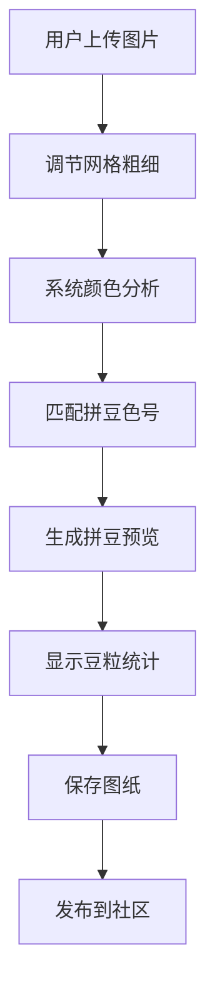

## 1. Product Overview
拼豆生图是一款将普通图片转换为拼豆图纸的创意工具应用。用户上传图片后，系统自动分析颜色并匹配拼豆色号，生成可打印的拼豆图纸，同时提供社交分享功能让用户交流创作。
- 主要用途：将图片转换为拼豆图案，辅助手工爱好者制作拼豆作品
- 目标用户：拼豆手工爱好者、DIY创作者、亲子家庭
- 市场价值：填补拼豆图纸生成工具的空白，提供一站式创作和分享平台

## 2. Core Features

### 2.1 User Roles
| Role | Registration Method | Core Permissions |
|------|---------------------|------------------|
| Normal User | Email/Third-party auth | Upload images, generate patterns, save, search, share, browse community |
| Admin | Manual setup | Manage content, moderate posts |

### 2.2 Feature Module
1. **首页**: 导航栏、热门作品展示、快速入口
2. **生图工具页**: 图片上传、网格调节、颜色匹配、生成预览、豆粒统计
3. **我的收藏页**: 收藏列表、搜索功能、删除管理
4. **发现页**: 搜索别人的图纸、热门推荐、分类浏览
5. **社区页**: 动态流、发布作品、点赞评论

### 2.3 Page Details
| Page Name | Module Name | Feature description |
|-----------|-------------|---------------------|
| 首页 | Hero section | 展示应用核心功能，快速上传入口 |
| 首页 | 热门作品 | 展示社区热门拼豆作品 |
| 生图工具页 | 图片上传 | 支持拖拽或点击上传图片 |
| 生图工具页 | 网格调节 | 滑块调节网格粗细（10-100格） |
| 生图工具页 | 颜色匹配 | 自动匹配拼豆色号（Perler/Hama/Artkal） |
| 生图工具页 | 生成预览 | 实时预览拼豆效果对比原图 |
| 生图工具页 | 豆粒统计 | 显示每种色号需要的豆粒数量 |
| 生图工具页 | 保存功能 | 自动保存生成的图纸 |
| 我的收藏页 | 列表展示 | 展示用户保存的所有图纸 |
| 我的收藏页 | 搜索 | 关键词搜索收藏的图纸 |
| 发现页 | 搜索 | 搜索其他用户上传的图纸 |
| 发现页 | 推荐 | 热门/最新图纸推荐 |
| 发现页 | 分类 | 按类型浏览图纸 |
| 社区页 | 动态流 | 类似朋友圈的瀑布流展示 |
| 社区页 | 发布 | 发布拼豆作品图片/视频 |
| 社区页 | 互动 | 点赞、评论功能 |

## 3. Core Process

### 用户生图流程
用户上传图片 → 调节网格大小 → 系统分析颜色匹配色号 → 生成拼豆图纸 → 查看豆粒统计 → 保存图纸

### 社交分享流程
用户进入社区 → 浏览动态 → 点赞评论 → 发布自己的作品

## 4. User Interface Design

### 4.1 Design Style
- Primary color: #FF6B9D (粉色系，活泼可爱)
- Secondary color: #4ECDC4 (薄荷绿，清新自然)
- Button style: 圆角矩形，柔和渐变
- Font: 标题用圆润可爱的字体，正文用清晰易读的字体
- Layout: 卡片式布局，简洁现代
- Icon style: 圆润可爱，色彩丰富

### 4.2 Page Design Overview
| Page Name | Module Name | UI Elements |
|-----------|-------------|-------------|
| 首页 | Hero section | 大标题、副标题、醒目上传按钮、渐变背景 |
| 首页 | 热门作品 | 横向滚动卡片列表，展示缩略图和标题 |
| 生图工具页 | 上传区域 | 虚线边框上传框，支持拖拽提示 |
| 生图工具页 | 参数调节 | 滑块控件，实时预览效果 |
| 生图工具页 | 预览区域 | 左右对比布局（原图 vs 拼豆图） |
| 生图工具页 | 色号统计 | 垂直滚动列表，颜色块+色号+数量 |
| 社区页 | 动态流 | 瀑布流布局，卡片展示图片和文字 |

### 4.3 Responsiveness
- Desktop-first design
- Mobile adaptive layout with hamburger menu
- Touch-optimized controls for mobile
- Responsive image grids

### 4.4 3D Scene Guidance
- Not applicable for this project