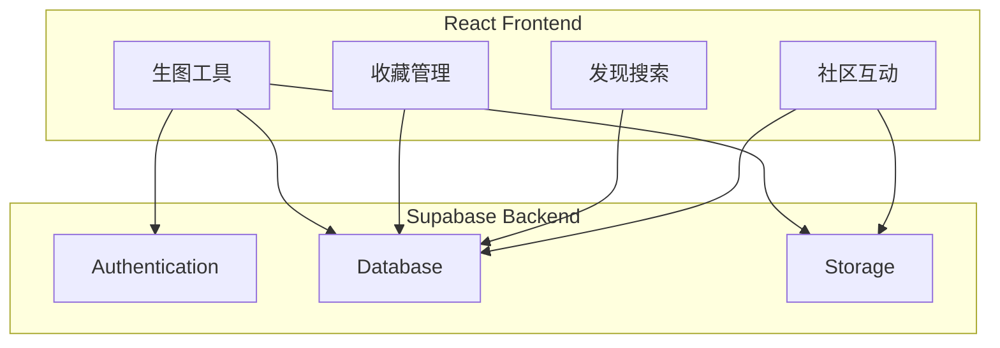
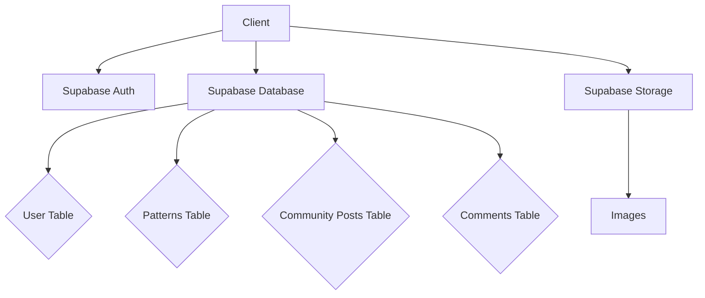
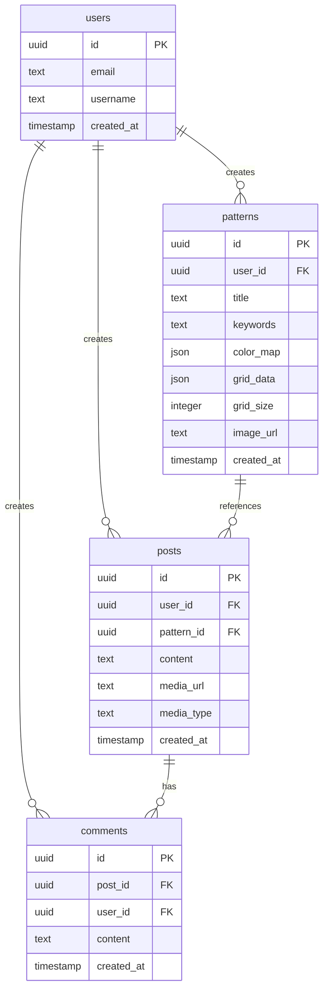

## 1. Architecture Design



## 2. Technology Description
- Frontend: React@18 + tailwindcss@3 + vite@6
- Initialization Tool: vite-init
- Backend: Supabase (Auth, Database, Storage)
- State Management: Zustand
- Icons: Lucide React

## 3. Route Definitions
| Route | Purpose |
|-------|---------|
| / | 首页 |
| /create | 生图工具页 |
| /saved | 我的收藏页 |
| /discover | 发现页 |
| /community | 社区页 |
| /login | 登录页 |
| /register | 注册页 |

## 4. API Definitions
使用 Supabase Client SDK 进行数据操作，无需自定义后端 API

## 5. Server Architecture Diagram


## 6. Data Model

### 6.1 Data Model Definition


### 6.2 Data Definition Language

```sql
CREATE TABLE patterns (
    id UUID PRIMARY KEY DEFAULT gen_random_uuid(),
    user_id UUID REFERENCES auth.users(id),
    title TEXT NOT NULL,
    keywords TEXT[],
    color_map JSONB,
    grid_data JSONB,
    grid_size INTEGER,
    image_url TEXT,
    created_at TIMESTAMP DEFAULT now()
);

CREATE TABLE posts (
    id UUID PRIMARY KEY DEFAULT gen_random_uuid(),
    user_id UUID REFERENCES auth.users(id),
    pattern_id UUID REFERENCES patterns(id),
    content TEXT,
    media_url TEXT,
    media_type TEXT,
    likes INTEGER DEFAULT 0,
    created_at TIMESTAMP DEFAULT now()
);

CREATE TABLE comments (
    id UUID PRIMARY KEY DEFAULT gen_random_uuid(),
    post_id UUID REFERENCES posts(id),
    user_id UUID REFERENCES auth.users(id),
    content TEXT NOT NULL,
    created_at TIMESTAMP DEFAULT now()
);

GRANT SELECT ON patterns TO anon;
GRANT SELECT ON posts TO anon;
GRANT SELECT ON comments TO anon;

GRANT ALL PRIVILEGES ON patterns TO authenticated;
GRANT ALL PRIVILEGES ON posts TO authenticated;
GRANT ALL PRIVILEGES ON comments TO authenticated;

CREATE POLICY "Users can view all patterns" ON patterns FOR SELECT USING (true);
CREATE POLICY "Users can create patterns" ON patterns FOR INSERT WITH CHECK (auth.uid() = user_id);
CREATE POLICY "Users can update their own patterns" ON patterns FOR UPDATE USING (auth.uid() = user_id);
CREATE POLICY "Users can delete their own patterns" ON patterns FOR DELETE USING (auth.uid() = user_id);

CREATE POLICY "Users can view all posts" ON posts FOR SELECT USING (true);
CREATE POLICY "Users can create posts" ON posts FOR INSERT WITH CHECK (auth.uid() = user_id);
CREATE POLICY "Users can update their own posts" ON posts FOR UPDATE USING (auth.uid() = user_id);
CREATE POLICY "Users can delete their own posts" ON posts FOR DELETE USING (auth.uid() = user_id);

CREATE POLICY "Users can view all comments" ON comments FOR SELECT USING (true);
CREATE POLICY "Users can create comments" ON comments FOR INSERT WITH CHECK (auth.uid() = user_id);
CREATE POLICY "Users can update their own comments" ON comments FOR UPDATE USING (auth.uid() = user_id);
CREATE POLICY "Users can delete their own comments" ON comments FOR DELETE USING (auth.uid() = user_id);
```